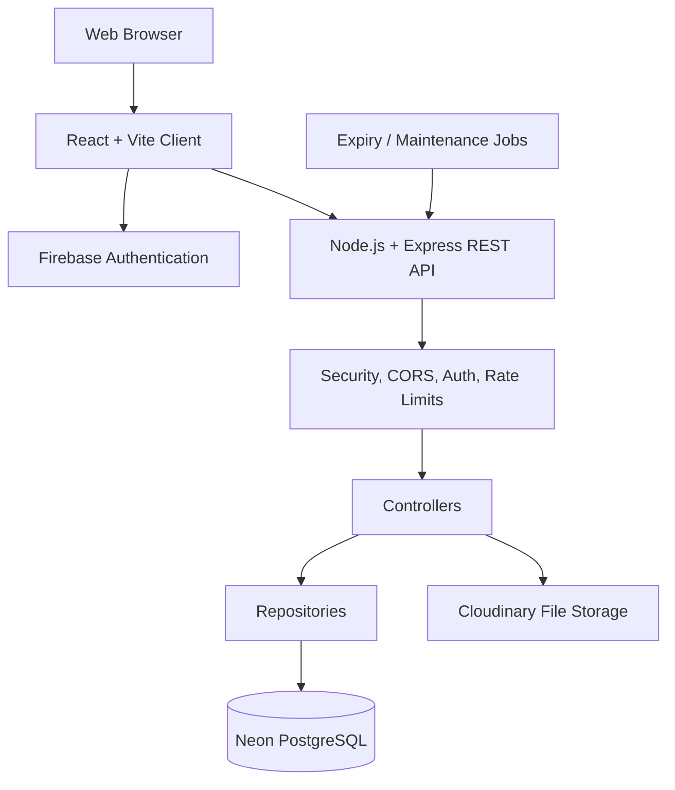
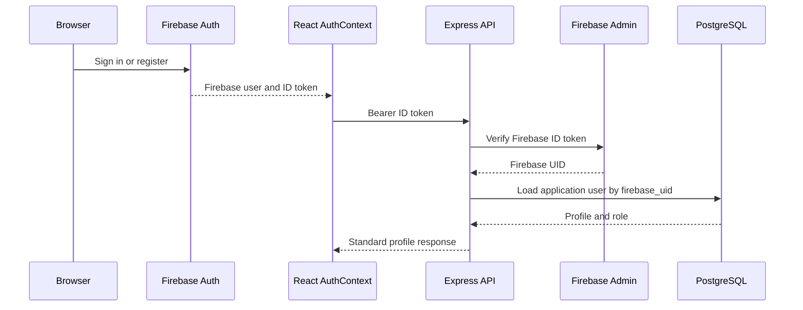
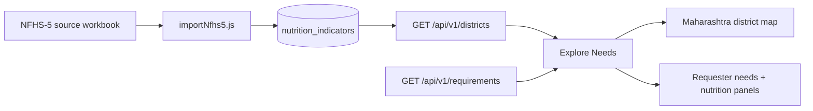
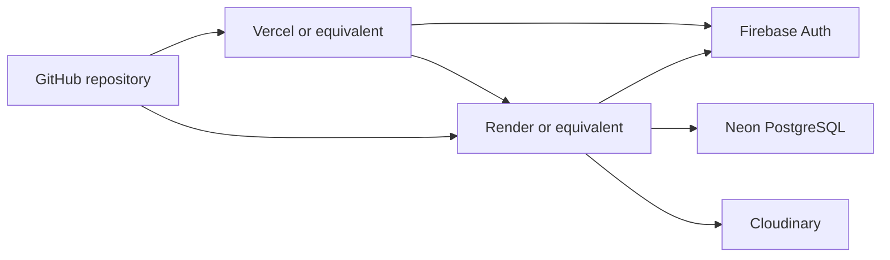

# PoshanSetu System Architecture

**Project:** PoshanSetu
**Architecture scope:** Maharashtra-wide nutrition needs and food-support platform
**Document status:** Current implementation and approved MVP architecture
**Last reviewed:** 2026-09-18

## 1. Purpose

PoshanSetu connects food donors with current, location-aware food requirements while presenting district-level nutrition context. The system answers:

1. Where is help needed?
2. Why may the location need attention?
3. How can a donor support a current requirement?

The platform keeps two information layers separate:

- **Official nutrition data:** district-level indicators imported from NFHS-5 and served with source and reporting metadata.
- **Current local requirements:** user- or institution-submitted requests for food items, quantities, urgency, location, and fulfillment status.

The platform coordinates discovery and confirmation. It does not process money, transport food, store food, diagnose deficiencies, or prescribe medical treatment.

## 2. Architectural Style

PoshanSetu is a layered full-stack web application and modular monolith. It is intentionally not split into microservices for the MVP.



### Layer responsibilities

| Layer | Responsibility | Must not do |
|---|---|---|
| React UI | Render pages, forms, map interactions, loading states, and navigation | Access PostgreSQL, Firebase Admin, or Cloudinary secrets |
| Client services | Send REST requests and normalize API responses | Implement database queries or trust client authorization |
| Express routes | Map HTTP methods and paths to controllers; apply middleware | Contain business rules or SQL |
| Middleware | Authenticate, authorize, validate transport, rate-limit, secure responses | Decide domain outcomes without the controller/service contract |
| Controllers | Parse requests, invoke domain operations, return standard responses | Expose SQL or secrets |
| Services/domain logic | Apply matching, lifecycle, quantity, trust, and notification rules | Handle HTTP presentation details |
| Repositories | Execute parameterized SQL and map rows to domain objects | Trust client-provided ownership or authorization |
| PostgreSQL | Persist relational application data and integrity constraints | Store binary files as the primary file store |
| Cloudinary | Store uploaded documents and media | Decide document verification status |

The current codebase has strong route/controller/repository boundaries. Some domain operations are currently implemented directly in repositories and controllers; a dedicated service layer should be extracted when domain complexity grows.

## 3. Repository Structure

```text
PoshanSetu/
|-- client/                 React + Vite frontend
|   |-- public/data/        GeoJSON and static client assets
|   |-- src/
|       |-- assets/         Images and brand assets
|       |-- components/     Reusable UI and domain components
|       |-- config/         Firebase client configuration
|       |-- context/        Authentication/session context
|       |-- hooks/          React hooks such as useAuth
|       |-- layouts/        Page/layout abstractions
|       |-- pages/          Public, auth, dashboard, and admin screens
|       |-- routes/         Route-related client modules
|       |-- services/       REST API client modules
|       |-- styles/         Shared style modules
|       |-- utils/          Pure helpers such as geographic utilities
|-- server/                 Node.js + Express backend
|   |-- scripts/            Operational checks
|   |-- src/
|       |-- config/         Environment, DB, Firebase Admin, Cloudinary
|       |-- controllers/    HTTP request handlers
|       |-- db/             Migrations, importers, migration runner
|       |-- middleware/     Auth, uploads, CORS, security, errors, limits
|       |-- repositories/   PostgreSQL access and row mapping
|       |-- routes/         Versioned REST route definitions
|       |-- services/       Domain service boundary
|       |-- utils/          Responses, audit logging, shared helpers
|       |-- validators/     Input validation boundary
|   |-- test/               Integration and business-flow test runner
|-- docs/                   Product, flow, design, and architecture documents
|-- agent_docs/             Engineering conventions and testing guidance
|-- postman/                API collections and environments
|-- AGENTS.md               Project source of truth for coding agents
|-- MEMORY.md               Project continuity and milestone history
```

## 4. Frontend Architecture

### 4.1 Runtime and dependencies

- React 19
- Vite 8
- React Router 7
- Tailwind CSS 4
- React Leaflet and Leaflet for the Maharashtra map
- Firebase client SDK for authentication
- Lucide React for icons
- Oxlint for linting

The frontend is a single-page application. Vite serves the development bundle and creates the production assets. React Router owns client-side navigation.

### 4.2 Application shell

`client/src/App.jsx` provides:

- `AuthProvider` for authentication and profile state
- `BrowserRouter` for navigation
- global `Navbar` and `Footer`
- route-level `ProtectedRoute` authorization
- `ScrollToTop` navigation behavior

The visual shell uses the project design tokens and Tailwind utility classes. Pages remain responsible for presentation; API access is exposed through `client/src/services/api.js`.

### 4.3 Frontend route groups

#### Public routes

- `/` - landing page
- `/explore` and `/browse` - Maharashtra discovery map and requirements
- `/districts/:districtId` - district insights
- `/requirements` - active requirement catalog
- `/requirements/:id` - requirement details
- `/food-match` - donor food matching flow
- `/about` and `/how-it-works` - product information

#### Authenticated workflows

- `/submit-need` and `/submit-requirement` - protected requirement submission
- `/requirements/:id/support` - protected support offer
- `/confirm-completion/:id` - support confirmation
- `/notifications` - in-app notifications

#### Role-specific routes

- `/donor/dashboard` - donor supports, stats, impact, and confirmations
- `/donor/supports/:supportId` - donor support details
- `/requester/dashboard` - requester requirements
- `/institution/dashboard` - institution/Ashram Shala requirement dashboard using the requester view
- `/requester/requirements/:id` - requirement management
- `/requester/requirements/:id/status` - lifecycle/status view
- `/institution-profile` - institution profile and document management
- `/admin/dashboard` - admin overview and review signals
- `/admin/review/:id` - requirement review
- `/admin/institution-review/:id` - institution verification review

`ProtectedRoute` checks Firebase authentication, loads the application profile, and enforces role allowlists. Redirects are role-aware so a user cannot use a URL from another role to bypass authorization.

### 4.4 Client state

The client uses React state and context rather than a global state library.

- **Auth state:** `AuthContext` stores the Firebase user, application profile, loading state, and auth actions.
- **Server state:** pages load API data through feature services and keep local loading/error/empty states.
- **Form state:** controlled inputs and step-based form components.
- **Map state:** selected district, hover state, district boundaries, live requirement severity, and district-specific panel data.

The client does not treat UI role checks as security. The server repeats authentication and authorization for every protected endpoint.

## 5. Authentication and Authorization

### 5.1 Authentication flow



### 5.2 Client authentication

`client/src/config/firebase.js` initializes the Firebase client SDK. `AuthContext`:

- observes Firebase auth state;
- obtains ID tokens;
- synchronizes newly registered users with `/api/v1/users/sync`;
- fetches `/api/v1/users/me` after sign-in;
- stores the application role and profile;
- routes users to role-specific dashboards.

### 5.3 Server authentication

`server/src/middleware/authMiddleware.js` provides:

- `verifyFirebaseToken`: validates the Bearer token with Firebase Admin;
- `attachUser`: loads the PostgreSQL user record by Firebase UID;
- `requireAuthenticatedUser`: rejects Firebase users without an application profile;
- `requireRole`: enforces role authorization.

Current roles include `donor`, `requester`, `institution`, and `admin`.

A protected request must pass both authentication and application authorization. A valid Firebase token alone is not enough to access donor, requester, institution, or admin data.

## 6. Backend Architecture

### 6.1 Express application

`server/src/app.js` creates the Express application and applies middleware in this order:

1. Load environment variables.
2. Security headers.
3. CORS policy.
4. JSON body parsing with a 1 MB limit.
5. Health routes.
6. Versioned API routes under `/api/v1`.
7. API not-found handling.
8. Central error handling.

`server/src/index.js` owns startup, environment validation, database initialization/checks, HTTP listening, and graceful shutdown.

### 6.2 API versioning and route modules

The versioned router is mounted at `/api/v1` and currently exposes:

- `/users`
- `/institutions`
- `/districts`
- `/requirements`
- `/offers`
- `/notifications`
- `/admin`

Health and operational routes:

- `GET /api/health`
- `GET /api/v1`
- `GET /api/v1/status`

Responses use the standard envelope from `server/src/utils/response.js`:

```json
{
  "success": true,
  "message": "Human-readable result",
  "data": {}
}
```

Errors use the same envelope with `success: false` and a safe message.

### 6.3 Request lifecycle

```text
HTTP request
  -> CORS/security/body middleware
  -> Firebase token verification, when protected
  -> application user attachment
  -> role authorization
  -> route controller
  -> validation and domain rules
  -> repository query/transaction
  -> notification/audit side effects
  -> standard JSON response
```

Routes are ordered so static paths such as `/mine/list` and `/admin/list` are registered before dynamic `/:id` paths.

## 7. Core Backend Modules

### Users

Handles Firebase-to-application profile synchronization, profile reads, and profile updates.

### Institutions

Handles institution profiles, institution ownership, verification documents, Cloudinary upload metadata, and admin verification state.

### Districts

Provides all 36 Maharashtra districts and their imported nutrition indicators. District data is read-only for normal users.

### Requirements

Handles requirement creation, public active catalog queries, owner management, expiry fields, item quantities, urgency, status, and admin approval/rejection where applicable.

Public requirement queries currently expose only active or partially supported, non-expired requirements.

### Offers

Handles donor support offers, donor offer lists, donor statistics, impact totals, offer details, donor/requester confirmation, and fulfillment transitions.

### Notifications

Stores and serves in-app notifications for requirement, offer, confirmation, fulfillment, and institution verification events.

### Admin

Provides operational statistics, institution verification review, requirement review, and fraud-signal visibility. Fraud signals are review indicators and do not automatically declare a user fraudulent.

## 8. Data Architecture

### 8.1 PostgreSQL responsibility

Neon PostgreSQL is the system of record for relational application data. The `pg` driver is used directly; no ORM is currently used.

The database stores:

- users and roles;
- institutions and verification state;
- institution document metadata;
- districts;
- nutrition indicators;
- requirements and requirement items;
- support offers and confirmations;
- notifications;
- audit events;
- fraud signals.

### 8.2 Important data separation

Nutrition indicators and requirements are different data domains:

```text
District nutrition indicators
  source: official imported dataset
  level: population/district
  purpose: context and transparency

Current requirements
  source: users/institutions
  level: individual requirement record
  purpose: actionable support matching
```

The UI must never state that a district indicator proves a specific person's or institution's deficiency.

### 8.3 Requirement lifecycle

Current and planned lifecycle states include:

```text
under_review -> active -> partially_supported -> fulfilled
       |             |              |
       v             v              v
    rejected       expired        history retained
```

Only valid active/partially supported requirements with remaining quantity and a valid expiry are eligible for public matching.

A requirement item stores both required and remaining quantity. Multiple donor offers can support one requirement. Fulfillment requires donor and requester confirmation before the item quantity is deducted and the requirement can become fulfilled.

### 8.4 Database access rules

- SQL is parameterized.
- Repository methods enforce ownership checks where required.
- Quantities are validated as positive on input and cannot be reduced below zero.
- Foreign keys and status constraints protect relationships.
- Migrations are stored in `server/src/db/migrations/` and executed by the migration runner.
- Existing migrations must not be rewritten; schema changes require a new migration.

## 9. District and Nutrition Data Flow



The project contains a static Maharashtra GeoJSON file for boundaries and a database-backed district API for district names and nutrition indicators. GeoJSON is a presentation boundary source; it is not a second source for requirements.

The Explore Needs map derives district fill severity from the live public requirement response:

- Critical -> red
- High -> orange
- Medium -> yellow
- Low -> green
- no relevant requirement -> neutral gray

It normalizes known district-name aliases so GeoJSON and database names match. Hover changes border emphasis only; it must not replace the severity fill.

## 10. Matching and Support Flow

### 10.1 Discovery flow

```text
Landing page or Explore Needs
  -> select/search Maharashtra district
  -> view district nutrition context
  -> view active local requirements
  -> open requirement details
  -> choose support
  -> sign in if needed
  -> create support offer
  -> complete donation offline
  -> donor confirms delivery
  -> requester confirms receipt
  -> offer and requirement status update
```

### 10.2 Current deterministic behavior

The MVP uses deterministic filters and business rules:

- district/location matching;
- food item matching;
- urgency filtering;
- active and expiry filtering;
- remaining quantity validation;
- duplicate active-offer prevention;
- owner cannot support their own requirement;
- dual confirmation for completion.

AI is not the source of truth for nutrition values, authorization, requirement status, or fulfillment.

### 10.3 Confirmation transaction

Confirmation operations use database transactions. The completion path:

1. records the donor or requester confirmation;
2. checks whether both confirmations exist;
3. marks the offer completed when both sides confirm;
4. decrements the matching requirement item quantity;
5. prevents negative remaining quantities;
6. updates the requirement to partially supported or fulfilled;
7. creates relevant notifications and audit records.

## 11. File and Document Storage

The approved file architecture is:

```text
React client
  -> authenticated multipart request
Express upload middleware
  -> MIME/type and size validation
Cloudinary
  -> binary document/media storage
PostgreSQL
  -> document type, URL, provider, public ID, status, timestamps, notes
```

Supported institution document types currently include PDF, JPG/JPEG, and PNG. Uploads are held in memory for validation and passed to Cloudinary. The database stores references and review metadata, not the primary binary file.

Cloudinary credentials are server-only environment variables. Document access must remain authorization-controlled.

## 12. Security Architecture

### Transport and application security

- Firebase ID tokens are verified server-side.
- Role checks are enforced on protected routes.
- CORS is restricted to configured client origins.
- Security headers are applied globally.
- Express fingerprinting is disabled.
- JSON payload size is limited.
- Mutation routes use rate limiting.
- SQL queries are parameterized.
- Uploads have MIME and size restrictions.
- Secrets are read from environment variables and must not be committed.
- Error responses hide internal database and stack details in production.

### Protected information

The system must not expose publicly:

- private contact information;
- private addresses beyond the approved public requirement detail;
- identity documents;
- fraud signals and internal review notes;
- Firebase Admin credentials;
- database or Cloudinary secrets.

### Auditability

Important actions are logged through the audit utility, including requirement creation, support offers, confirmations, fulfillment, institution verification, and administrative actions.

## 13. Validation and Error Handling

Validation occurs at multiple boundaries:

- client forms provide immediate user feedback;
- controllers validate required request fields;
- validators enforce UUID, pagination, urgency, quantity, beneficiary, expiry, and file rules;
- repositories apply ownership, status, expiry, and relational checks;
- PostgreSQL constraints protect final integrity.

The server centralizes errors through `errorHandler.js`. User responses are concise and safe; detailed diagnostic information is logged server-side.

## 14. Notifications

Notifications are stored in PostgreSQL and delivered as in-app notifications. Current events include:

- requirement submitted;
- requirement approved or rejected;
- support offer received;
- donor delivery confirmed;
- requester receipt confirmed;
- requirement fulfilled;
- institution verification status changed.

Email, SMS, and push notifications are outside the current MVP path.

## 15. Deployment Architecture



### Local development

The root workspace orchestrates client and server commands:

```powershell
npm install:all
npm run dev
npm run build
npm test
```

Available focused commands:

```powershell
npm run dev:client
npm run dev:server
npm run build:client
npm run build:server
npm --prefix client run lint
npm --prefix server run migrate
npm --prefix server run import:nfhs5
```

Development uses separate client and server environment files. Production secrets belong in the hosting provider configuration.

### Environment responsibility

Client environment variables may contain only public browser-safe values such as the API base URL and Firebase client configuration. Server environment variables hold private values such as:

- `DATABASE_URL`
- Firebase Admin project credentials
- Cloudinary API credentials
- `CLIENT_URL`
- `PORT`
- `NODE_ENV`

No secret should be embedded in client code or committed to Git.

## 16. Testing Architecture

The current server test runner covers:

- health and public API endpoints;
- all 36 Maharashtra districts;
- authentication and RBAC rejection;
- security headers and CORS;
- malformed JSON handling;
- UUID and pagination validation;
- requirement input validation;
- rate limiting;
- document MIME validation;
- dual-confirmation and quantity state consistency;
- fulfillment-rate calculations.

Recommended additional coverage:

- frontend map severity aggregation for Critical + Low, High + Medium, and no active requirements;
- district-click replacement of requester and nutrition panel data;
- multiple requirements in one district;
- expired/fulfilled/rejected exclusion;
- authenticated browser journeys for donor, requester, institution, and admin roles;
- responsive and accessibility checks.

The client production build is the primary compile validation. Client lint currently reports warnings in existing files; warnings do not replace behavioral tests.

## 17. Observability and Operations

Current operational mechanisms include:

- `/api/health` for API/database health;
- startup environment validation;
- server-side error logging;
- audit log records;
- admin fraud-signal and verification views;
- graceful HTTP/database shutdown;
- migration and data-import scripts.

Future production improvements may include structured logs, request correlation IDs, uptime monitoring, database metrics, and error reporting.

## 18. Known Boundaries and Risks

1. **Institution verification:** document review improves trust but is not legal or registry-backed KYC.
2. **Nutrition interpretation:** district-level indicators are population context and cannot diagnose individuals.
3. **Free-tier limits:** Firebase, Neon, Cloudinary, hosting, and map services have changing quotas.
4. **Public data freshness:** NFHS-5 is periodic, not real-time; reporting period and source must remain visible.
5. **Client data availability:** public pages need explicit loading, empty, and API-error states.
6. **Authentication dependency:** complete protected-flow browser testing requires valid Firebase credentials.
7. **Map dependency:** district boundary rendering depends on the checked-in GeoJSON asset; requirement severity depends on the live API.
8. **No payment or logistics layer:** real-world donation handoff occurs outside PoshanSetu.

## 19. Architectural Rules for Future Changes

- Keep Maharashtra as the authoritative current geographic scope while preserving future state/city expansion paths.
- Keep official nutrition data separate from user-submitted requirements.
- Keep route, controller, validation, service, repository, and UI responsibilities distinct.
- Never move secrets to the client.
- Add migrations instead of modifying applied migrations.
- Use parameterized SQL only.
- Enforce authorization on the server for every protected action.
- Preserve requirement and support history.
- Require dual confirmation before marking support fulfilled.
- Treat fraud signals as review indicators, not automatic accusations.
- Use deterministic rules for matching and fulfillment; AI may explain or parse, but must not invent facts or make safety-critical decisions.
- Add focused tests for every new lifecycle, authorization, data-separation, and matching rule.
